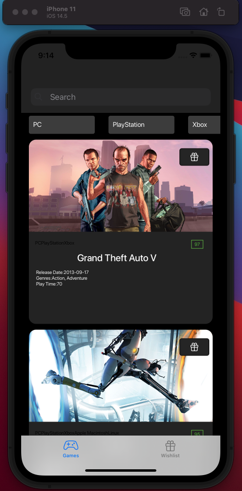
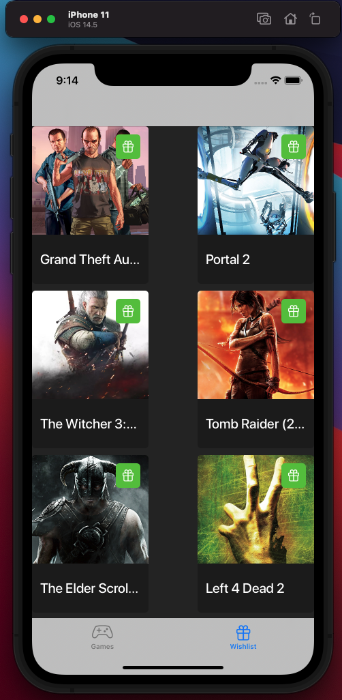
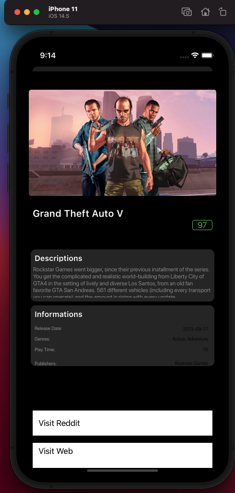

# GameCardProject
Game card project developed with autolayout logic and used Alamofire for HTTP request which come from network layer. 
<table>
  <tr>
    <td>Main Page</td>
     <td>Wishlist</td>
     <td>Game Detail Page</td>
  </tr>
  <tr>
    <td></td>
    <td></td>
    <td></td>
  </tr>
 </table>

